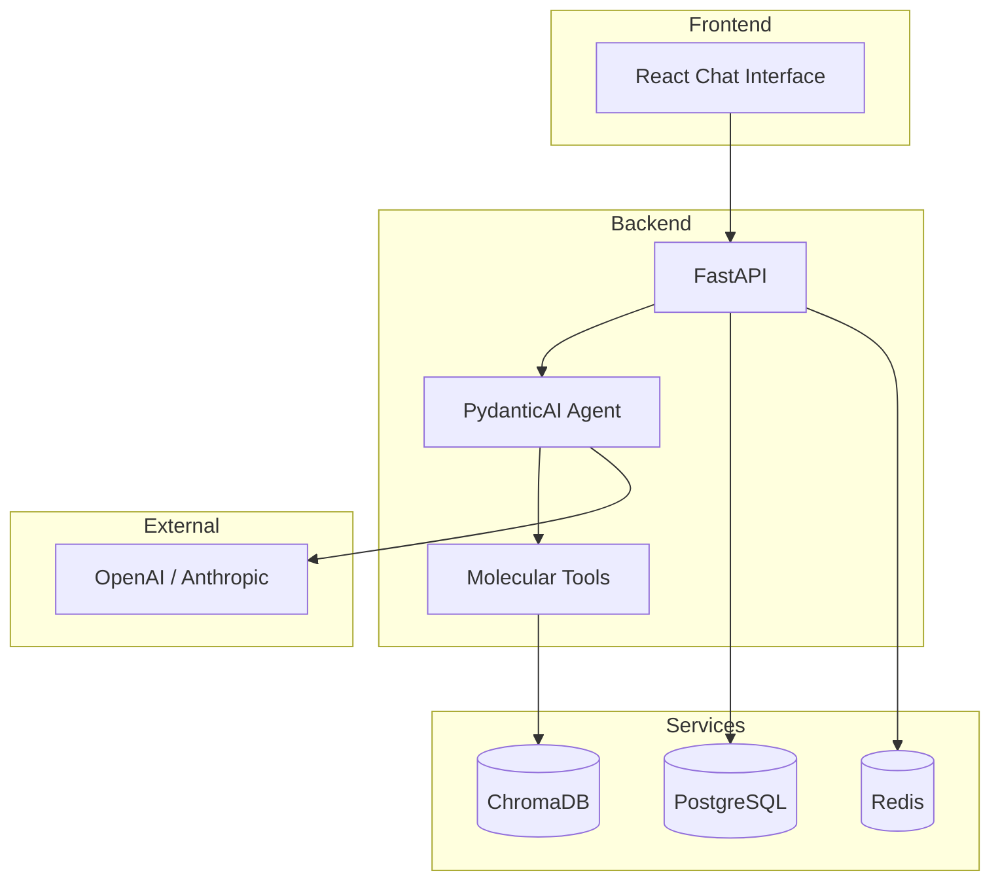

# MolecularAgent

An AI agent platform for drug discovery that combines large language models with specialized molecular tools and scientific knowledge retrieval.

## Overview

MolecularAgent is an agentic AI system designed to assist in computational drug discovery workflows. The platform orchestrates LLMs with domain-specific molecular tools, retrieval-augmented generation (RAG) over scientific databases, and multi-agent collaboration to iteratively design and evaluate drug candidates.

## Architecture



## Features

### Molecular Tools
- **SMILES Validator** - Validate and canonicalize SMILES strings
- **Property Predictor** - Calculate molecular properties (MW, LogP, TPSA, etc.)
- **Drug-Likeness Checker** - Evaluate Lipinski's Rule of Five
- **Similarity Search** - Tanimoto similarity calculation between molecules
- **Molecule Generator** - Generate drug-like molecules

### Knowledge Retrieval (RAG)
- **Literature Search** - Search PubMed abstracts for scientific papers
- **Compound Search** - Search ChEMBL for approved drugs and clinical candidates

### AI Agent
- Powered by PydanticAI framework
- Supports OpenAI (GPT-4) and Anthropic (Claude) models
- Automatic tool selection and execution
- Conversation history persistence

## Quick Start

### Prerequisites
- Docker and Docker Compose
- OpenAI or Anthropic API key

### Setup

1. Clone the repository:
```bash
git clone https://github.com/yourusername/molecularagent.git
cd molecularagent
```

2. Set up environment variables:
```bash
cp .env.example .env
# Edit .env and add your API keys
```

3. Start the services:
```bash
./scripts/setup-dev.sh
# Or manually:
docker compose up -d
```

4. Access the application:
- Frontend (after docker compose): http://localhost:3000
- Backend API: http://localhost:8000
- API Docs: http://localhost:8000/docs

### Data Ingestion

To populate the vector database with scientific literature and compound data:

```bash
# Run all ingestion scripts (PubMed + ChEMBL)
docker compose exec backend python scripts/ingest_all.py

# Clear existing data and re-ingest
docker compose exec backend python scripts/ingest_all.py --clear

# Ingest only PubMed abstracts
docker compose exec backend python scripts/ingest_all.py --skip-chembl

# Ingest only ChEMBL compounds
docker compose exec backend python scripts/ingest_all.py --skip-pubmed

# Customize ingestion limits
docker compose exec backend python scripts/ingest_all.py --pubmed-max 200 --chembl-max 1000
```

You can also run ingestion scripts individually:

```bash
# Ingest PubMed abstracts
docker compose exec backend python scripts/ingest_pubmed.py

# Ingest ChEMBL compounds
docker compose exec backend python scripts/ingest_chembl.py
```

## Development

### Running Tests
```bash
# Run all tests
docker compose exec backend pytest -v

# Run with coverage
docker compose exec backend pytest --cov=app --cov-report=html
```

### Project Structure
```
molecularagent/
├── backend/
│   ├── app/
│   │   ├── api/routes/      # API endpoints
│   │   ├── core/            # Configuration
│   │   ├── services/        # Business logic (agent, RAG)
│   │   └── tools/           # Molecular & RAG tools
│   ├── scripts/             # Data ingestion scripts
│   │   ├── ingest_all.py    # Run all ingestion
│   │   ├── ingest_pubmed.py # PubMed abstracts
│   │   └── ingest_chembl.py # ChEMBL compounds
│   └── tests/
├── frontend/
│   └── src/
│       └── components/Chat/ # Chat UI components
├── compose.yml              # Docker Compose config
└── scripts/                 # Helper scripts
```

### Environment Variables

| Variable | Description | Default |
|----------|-------------|---------|
| `POSTGRES_USER` | Database user | `postgres` |
| `POSTGRES_PASSWORD` | Database password | `postgres` |
| `POSTGRES_DB` | Database name | `molecularagent` |
| `REDIS_HOST` | Redis host | `localhost` |
| `CHROMADB_HOST` | ChromaDB host | `localhost` |
| `CHROMADB_PORT` | ChromaDB port | `8000` |
| `OPENAI_API_KEY` | OpenAI API key | - |
| `ANTHROPIC_API_KEY` | Anthropic API key | - |
| `LLM_PROVIDER` | LLM provider (`openai` or `anthropic`) | `openai` |

## API Reference

### Chat Endpoint
```
POST /api/v1/agent/chat
```
Request:
```json
{
  "message": "Is aspirin drug-like?",
  "conversation_id": null
}
```

### Molecular Endpoints
- `POST /api/v1/molecules/validate` - Validate SMILES
- `POST /api/v1/molecules/properties` - Get molecular properties
- `POST /api/v1/molecules/drug-likeness` - Check Lipinski rules
- `POST /api/v1/molecules/similarity` - Calculate similarity

### RAG Endpoints
- `POST /api/v1/rag/literature/search` - Search scientific literature
- `POST /api/v1/rag/compounds/search` - Search ChEMBL compounds
- `GET /api/v1/rag/stats` - Get collection statistics

## Tech Stack

- **Backend**: FastAPI, PydanticAI, SQLModel, RDKit
- **Frontend**: React, TailwindCSS, TanStack Query
- **Database**: PostgreSQL
- **Vector Store**: ChromaDB
- **Cache**: Redis
- **LLM**: OpenAI GPT-4 / Anthropic Claude
- **Containerization**: Docker, Docker Compose

## License

MIT
